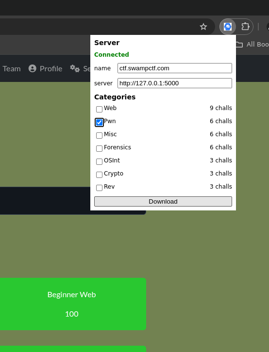
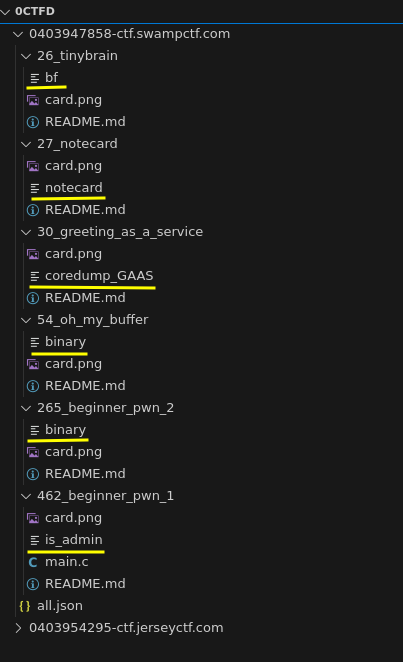
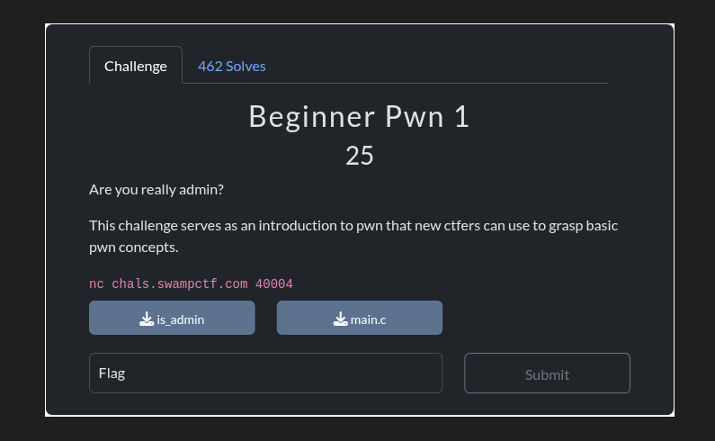
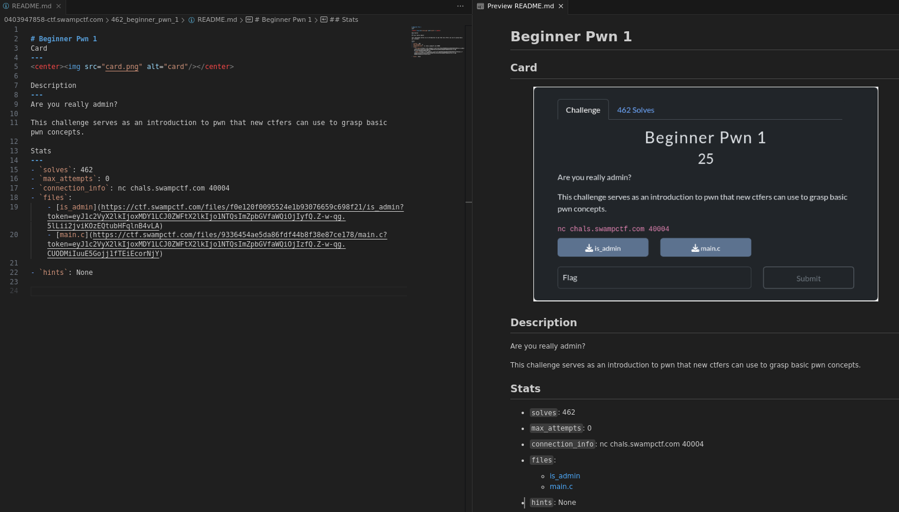

# Docs

## Extension  
Once you enter the CTF (which must use CTFd under the hood), click on the extension. It will check the **server status** and **load all the challenges**.  

<p align="center">
     
</p>

<br><br>

### Server Tab  
- We can see that the server is **connected** because I'm running the Flask server in the background.  
    - `name` refers to the CTF name. You can change it here. It uses the site's **hostname** by default.  
    - `server` refers to the Flask server **address**. Change it if you have a different **address**.  

   
### Categories Tab  
- First, it loads all the **categories**. It uses the provided CTF category names.  
- You can select any category you want from here and **download** it.  

- Once you click on **download**, it will extract the challenge info, which includes:  
    - `name, solves, id, value, desc, connection_info, files, hints, view, max_attempts, screenshot`  


## Server  
Moving on to the Flask server. It just waits for the extension to send a **POST request** with the info.  
You can configure it a bit using the **config.json** file:  
```
{
    "ctf-dir" : "~/0ctfd",
    "sync-download": true 
}
```

- `ctf-dir`: The directory where the server will save your CTF.  
- `sync-download`: Option to control whether the download of the files is blocking or not. By default, the download is blocking, but if the server is not rate-limiting or something, you


<br>

The CTF directory will be named: `time - {the CTF name}`. The time is calculated using the formula `2147483647 - now()`. This will ensure that your latest CTF will be on top of the list. I did this because I'm in the process of working.  


<p align="center">
     
</p>


- We can see 3 types of files:  
    - `card.png`: Is the HTML challenge card  
        - Example:
            <br>
             
    <br>

    - `README.md`: A markdown file containing all the information about the challenge  
        - Example: 
            <br>
             
    <br>
    
    - The rest are the challenge files  


## What's next?  
Next, you go solve the challenges :)  